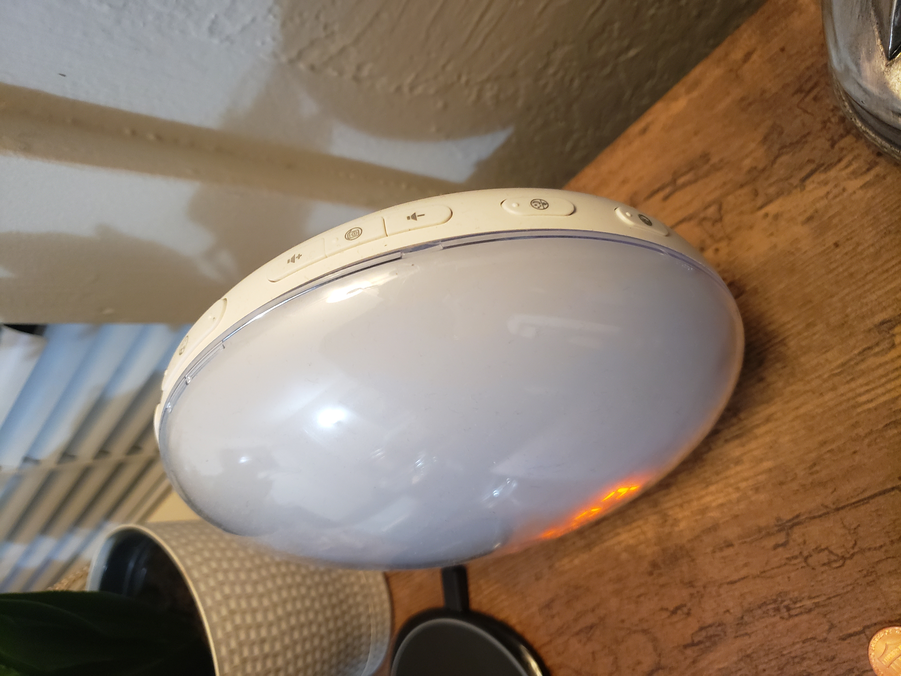
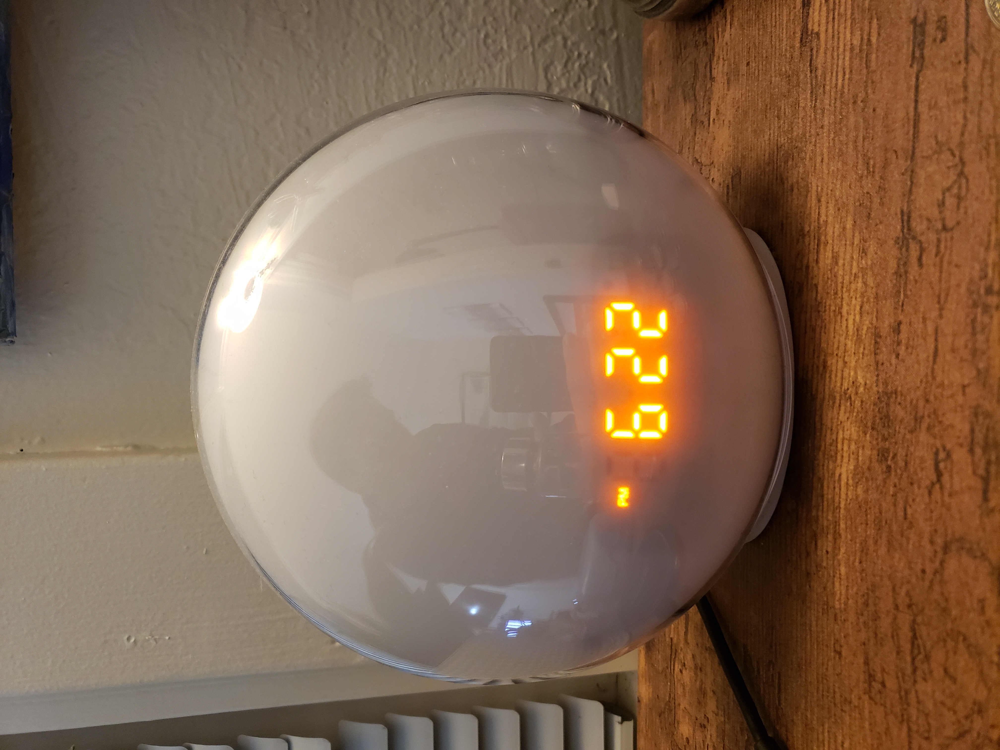
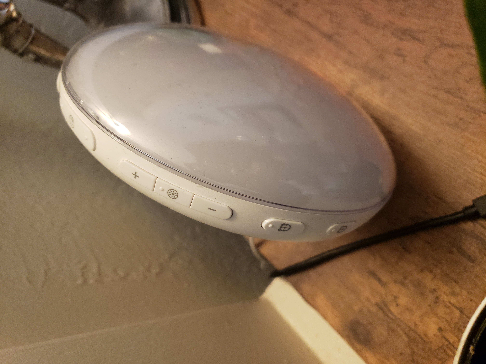

## Sunrise Alarm Clock - User Experience (02/23/22)

By Cole Hopkins

[Return to Home](../)

  
   
  

I have an alarm clock that I find horrible to operate, and incredibly confusing. Not only are the buttons to configure the clock somewhat vague, but the fact that the buttons circle the entire perimeter of the clock makes it a task to find what you're looking for. I have owned this clock for about a year, and still have no idea what the buttons do. Since each button has roughly the same shape and size, and each has an icon that is informative. Along with this, some buttons have multiple uses if clicked after other buttons, making a clock that is not **learnable** nor **memorable** unless you have meticulously studied the instruction pamphlet.

Because the buttons are circling the clock, it is impossible to see all buttons at once. This makes it basically a chore to locate the button you want to use to complete a task. Sometimes I find myself looking at it for a couple of minutes until I can identify which button I should press, which makes this a very **inefficient** clock to use if time is of importance. Most of the issues come with trying to change the alarm time or change the time on the clock. You have to press multiple buttons in a specific order to be able to alter clock time, and altering the hours and minutes is its own struggle. Although, there was one button which has good **mapping**, that being the largest button on the very top being the snooze button. I had no problem finding this since every alarm clock I’ve come across always has this same design. All other buttons did not have **natural mapping**, making it still a struggle for me to **memorize** their functions

To set an alarm, you have to go through many unnecessary steps. First, you have to hold the time button on the left buttom side of the clock, and locating it without picking up and turning the entire clock is harder than it should be. Then, you have to click the two buttons above to choose which profile you want to set the the alarm too, which are easy to identify since the icon is very **learnable**. Then you must click the button in the top middle to change from hour to minutes, and clicking the left and right button beside it to alter the specific hour/minute you want to set it to. Finally you have to set it for either AM or PM by clicking the top middle button again, and then click the time profile that you selected before to save it to that profile. Overall, this is just some of the **inefficient** ways that this clock was designed, focusing more on the aesthetic of the device rather than simplicity and functionality. 

Although I struggle with the button layout and icon designs, other aspects of this clock are **effective**, that being the alarm system. The entire face of the clock basically acts as a lightbulb, naturally waking you up from sleep. The alarm tones are also very **efficient**, and I’ve never slept through the first 5 seconds of it being activated, so it has served its purpose. It is fairly **error-tolerant** as well, as I have never had any issues in it and the clock is fairly simple so it would be hard to create errors unless a button had broke or the LED's died. Overall, I think this alarm clock serves its purpose and is **effective** in the task in which it was created, but **inefficient** in the user's ability to **learn** how to operate it and **memorize** all the functionality it provides.

[Return to Home](../)
