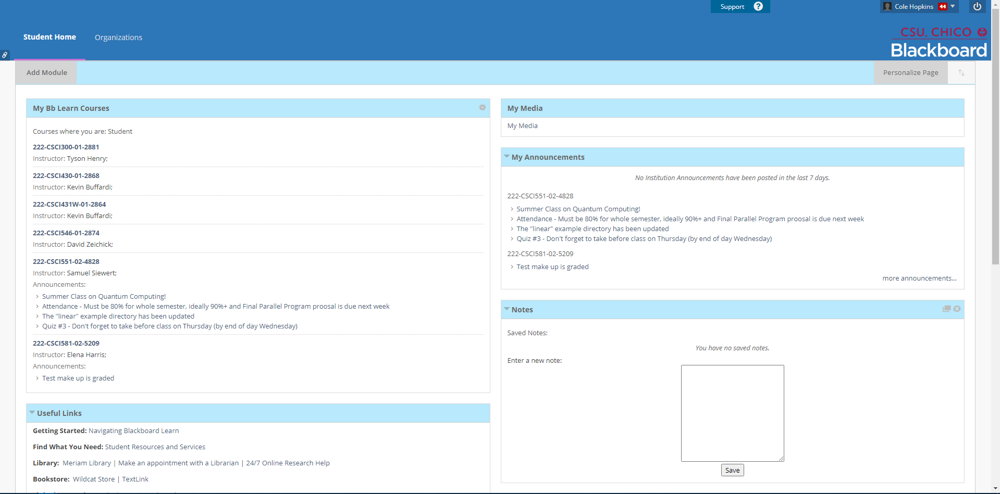

## Blackboard Learn - User Experience (04/15/22)

By Cole Hopkins

[Return to Home](../)

When it comes to a Learning Management Systems, or LMS for short, it’s important to have a system in place that is both highly **effective** for both students and professors/teachers alike. Having experienced and worked with three different LMS throughout my schooling, Blackboard Learn has the weakest UX design of them all, making it a headache for new user to **memorize** the complex and tedious traversal of the application. Below I will explain some of these flaws, but preface on students' experience since I fall under this category. 

When observing the application through the lens of the 10 **Usability Heuristics** developed by Jakob Nielsen, almost every single general principle is relatively weak. The main examples would have to be Heuristic 6-8, which are that is it . Blackboard learn is very complex, and does not have a **aesthetic or minimalist design** at all, making it quite a challenge to **memorize** as a new student. While making this journal entry, I stumbled upon a calendar which shows when assignments are due. I had not known about this before, but it was really tucked away in a drop-down option that is barely visible, and navigating to the calendar instead of it being on the homepage by default is rather **inefficient**. The **flexibility and efficiency of use** that Blackboard Learn provides is rather weak, providing little personalization and customizability for students to put useful information that is important on the home page. Furthermore, each student must delete and maintain the classes that show up on their homepage, rather than it being automatically changed. Classes are only identifiable by the course section number, rather than displaying the class name in human readable form, making students **recall rather than recognize** what class they are navagating to.

Another issue which Blackboard Learn promotes is professor/teacher class page customizability. Since both professors and teachers have almost unlimited customizability and structure freedom for their pages, it causes students to become confused and have to **learn** the structure and where all the important information resides for each class, every single semester. Some classes are structured so differently, that is makes it very **ineffective** for student learning. I personally have probably spent many hours throughout my use with this application just scanning every page to check if I missed anything, or looking for notes or assignments that aren't clear where they reside. Although some professors make it easier to navigate than others, a solution would be a template which cannot be altered, and where the structure of each class is relatively the same. Professors and Teachers also all have different ways and methods they use to show and calculate grades, making it hard for some students to understand their current standing, and see what and what has not been completed. Having all classes have a similar structure and set grading system would make this application much more user friendly, and easy to **memorize** and become **efficient** at finding information needed.

A simple step by step of how I have to operate Blackboard Learn should show why I do not like using it, especially when I have 5 classes that I have to manage. If I go to one professors page to view homeworks due, I can expect to find it it the homeworks tab. Once I get here it is formatted in a certain way, that I have to **learn** how it works while also learning the class content at the same time. Then, if I leave this class and go to another class on blackboard, I can expect to find the homework in the homework tab like the previous, but this isn't always the case. Then I have to reflect about how I last used this classrooms format, and navigate through different tabs until I see something that resembles homework. Finally, when I do find the homework, it's organized in a completely different way, again having to rely on memory or using my time to filter through it to find the homework I need to do. I would say this procedure happens everyday, and i've probably wasted a couple hours of my life trying to find and learn where things are every semester, and sometime my grade has taken a hit because of these reasons. 

There are many other small issues and usability concerns I have with Blackboard, but even though it’s design is slightly outdated and not very customizable, it is fairly easy to navigate and understand what most of the other buttons do. There's a logout, and support button for users who are stuck and need help navigating, which is important for usability purposes. I have used Canvas previously, and found it to be a much more **learnable** and **satisfying** tool for student learning, with a minimalist design that gave users all the information they may need with an easy to navigate design. I hope Blackboard Learn can adopt these design aspects to make it easier for new and old students to navigate.

[Return to Home](../)
